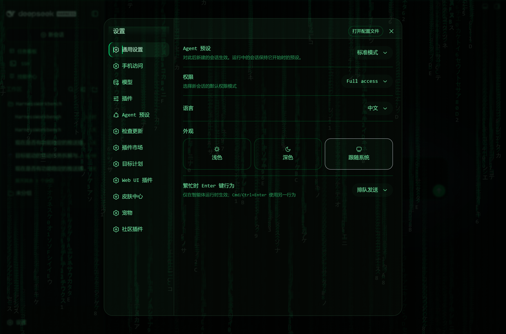
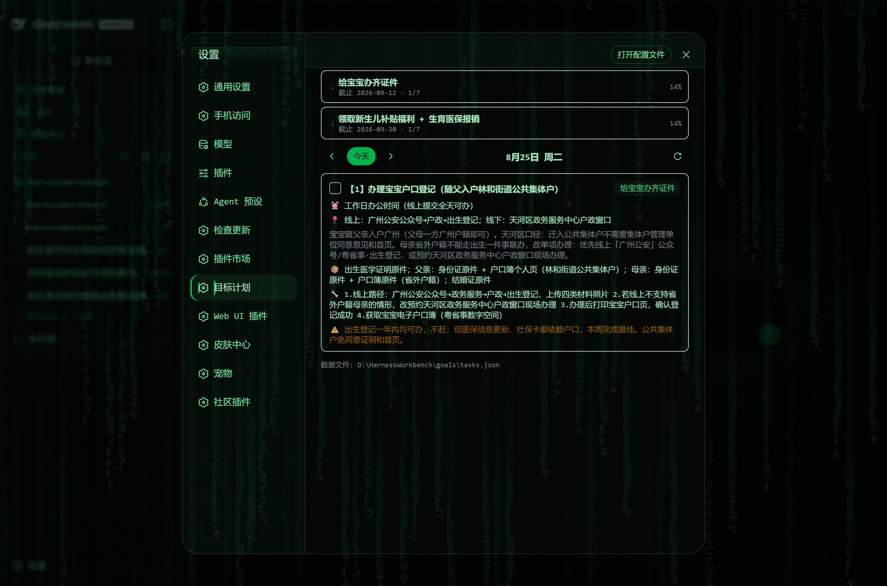
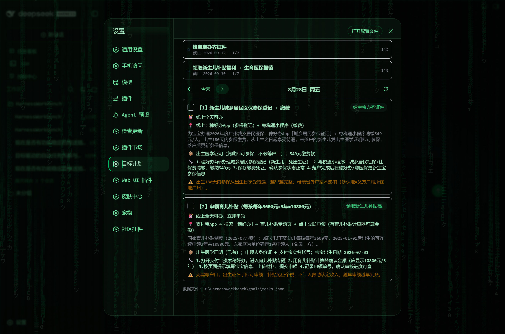

# dsh-goal-planner

<p align="center">
  <a href="https://github.com/caseyyy/dsh-goal-planner/stargazers"></a>
  <a href="LICENSE"></a>
  <a href="https://awesome-dsh-plugin.com/zh/"></a>
</p>

目标驱动的每日任务计划器（DeepSeek Harness 插件）：多目标任务数据 + Web 端「目标计划」预览面板，与微信提醒推送链路共享同一份数据文件。

Goal-driven daily task planner for DeepSeek Harness: multi-goal task data plus a daily preview panel in the Web GUI, sharing one data file with the WeChat reminder pipeline.

## 功能 / Features

- 🎯 **多目标 / Multi-goal**：`goals[]` 支持并行多个目标（每个目标独立截止日期），新目标不覆盖旧目标 / parallel goals with independent deadlines; adding a new goal never overwrites existing ones
- 📅 **每日预览 / Daily preview**：设置 → **目标计划** 面板，按日期翻页查看每一天的任务 / open Settings → **Goal Planner** and page through every day's tasks
- ✅ **一键完成 / One-click done**：面板里直接勾选任务完成/恢复，数据即时落盘 / toggle tasks done/todo in the panel; changes persist immediately
- 🔌 **与推送链路共享数据 / Shared data**：`tasksPath` 配置指向现有 `tasks.json`，即可与 `push-daily.mjs` + `dsh-automation` 的每晚微信推送共用同一份数据 / point `tasksPath` at an existing `tasks.json` to share it with the nightly WeChat push pipeline (`push-daily.mjs` + `dsh-automation`)
- 🔒 **Loopback 安全 / Loopback only**：HTTP API 仅允许 127.0.0.1 访问 / the HTTP API accepts loopback requests only

## 界面预览 / Screenshots

设置侧边栏入口 / Settings entry（设置 → 目标计划 / Settings → Goal Planner）：



今日任务面板（目标概览 + 日期导航 + 任务卡片）/ Today's panel (goal overview + date navigation + task cards)：



多任务日期（同一天多个任务依次排列，可一键勾选完成）/ A multi-task day (several tasks listed together, one-click done toggle)：



## 数据模型 / Data model

```json
{
  "updatedAt": "2026-08-24",
  "goals": [
    { "id": "G1", "title": "给宝宝办齐证件", "deadline": "2026-09-12", "note": "背景备注（可选）" }
  ],
  "tasks": [
    {
      "id": "T01",
      "goalId": "G1",
      "title": "任务标题",
      "detail": "做什么、做到什么程度算完成",
      "time": "具体时间/时段",
      "location": "地点/线上入口",
      "materials": ["要准备的材料"],
      "steps": ["步骤 1"],
      "note": "注意事项",
      "dueDate": "2026-08-25",
      "status": "todo | doing | done"
    }
  ]
}
```

字段说明 / Field notes：`title`、`goalId`、`dueDate`、`status` 必填；`detail`/`time`/`location`/`materials`/`steps`/`note` 可选，有值才在面板与推送中显示 / required: `title`, `goalId`, `dueDate`, `status`; optional fields are shown only when present.

## 安装 / Install

```sh
dsh plugin --profile web add github:caseyyy/dsh-goal-planner
# 本地开发 / local development:
dsh plugin --profile web add link:D:/path/to/dsh-goal-planner -w
```

重启 `dsh web` 后，设置页左侧出现 **目标计划** 入口。

Restart `dsh web`; the **Goal Planner** entry then appears in Settings.

### 指向已有数据文件 / Point at an existing data file

在 profile 的 `cordis.patch.yml` 中覆盖配置 / override in your profile's `cordis.patch.yml`:

```yaml
- id: goal-planner
  config:
    tasksPath: 'D:\\HarnessWorkbench\\goals\\tasks.json'
```

留空则使用 `$DSH_HOME/dsh-goal-planner/tasks.json`。 / Leave empty to use `$DSH_HOME/dsh-goal-planner/tasks.json`.

## HTTP API（仅 loopback / loopback only）

| 方法 Method | 路径 Path | 说明 Description |
|---|---|---|
| GET | `/api/goal-planner/state` | 返回 `{ ok, path, document }` / returns the full document |
| POST | `/api/goal-planner/save` | 整体保存文档（结构校验）/ replaces the document (validated) |
| POST | `/api/goal-planner/toggle` | `{ taskId }` 翻转 todo ↔ done / flips a task's todo/done status |

## 与提醒链路配合 / Working with the reminder pipeline

典型组合（作者自用）/ The typical setup the author runs daily:

- **拆解排期 / Decompose & schedule**：对话中告诉 agent「我的目标是 XXX，截止 YYYY-MM-DD」→ agent 搜索步骤/材料并写入本插件的数据文件 / in a chat, tell the agent "my goal is X, due YYYY-MM-DD" — it researches steps and materials and writes them into this plugin's data file
- **每日微信推送 / Nightly WeChat push**：`dsh-automation` 规则每天 20:30 运行 `node push-daily.mjs`，把「明天」到期任务经 Server酱 推送到微信 / a `dsh-automation` rule runs `node push-daily.mjs` at 20:30 daily and pushes tomorrow's due tasks to WeChat via ServerChan
- **随时预览 / Preview anytime**：本插件面板按天翻看任务 / browse tasks day by day in this plugin's panel

## 开发 / Development

```sh
npm install        # 仅需 esbuild / only esbuild is needed
npm run build      # lib/index.js + lib/client.js
```

- Host 端 `src/index.js`：数据读写 + HTTP 路由（`ctx.inject(['webServer'])`）/ Host half `src/index.js`: data read/write + HTTP routes via `ctx.inject(['webServer'])`
- Client 端 `src/client/*`：React 面板，external 依赖宿主平台模块表；构建为 CJS 并经 `window.__ModuleLoader__.load` 自注册 / Client half `src/client/*`: React panel; externals resolve from the host platform module table; the bundle is built as CJS and self-registers through `window.__ModuleLoader__.load`

## License

[GPL-2.0](LICENSE)
